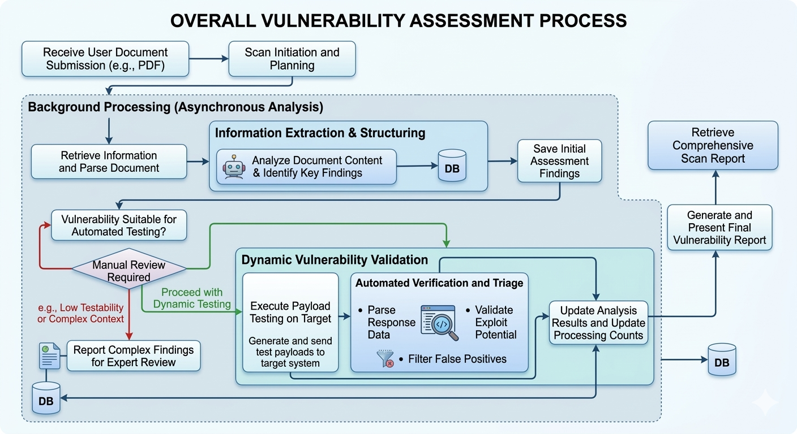
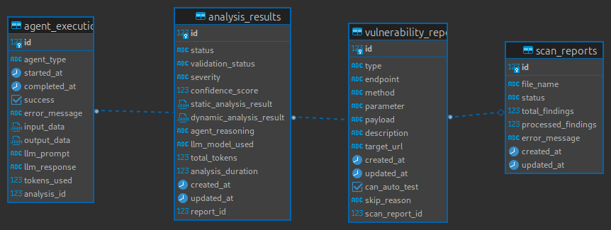
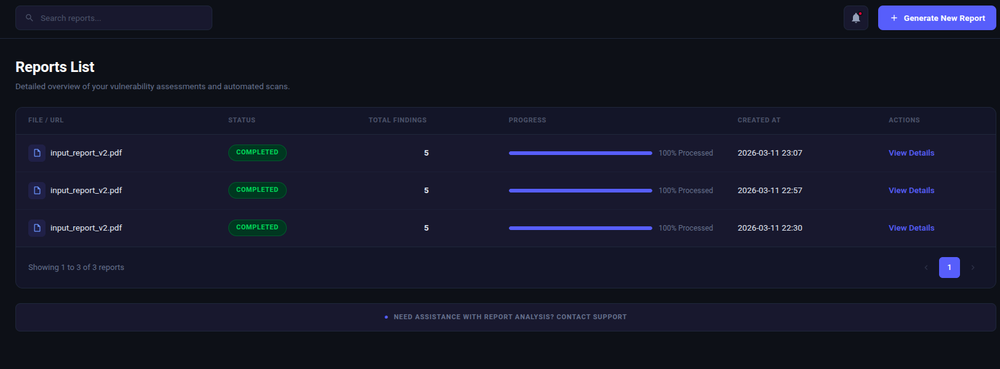
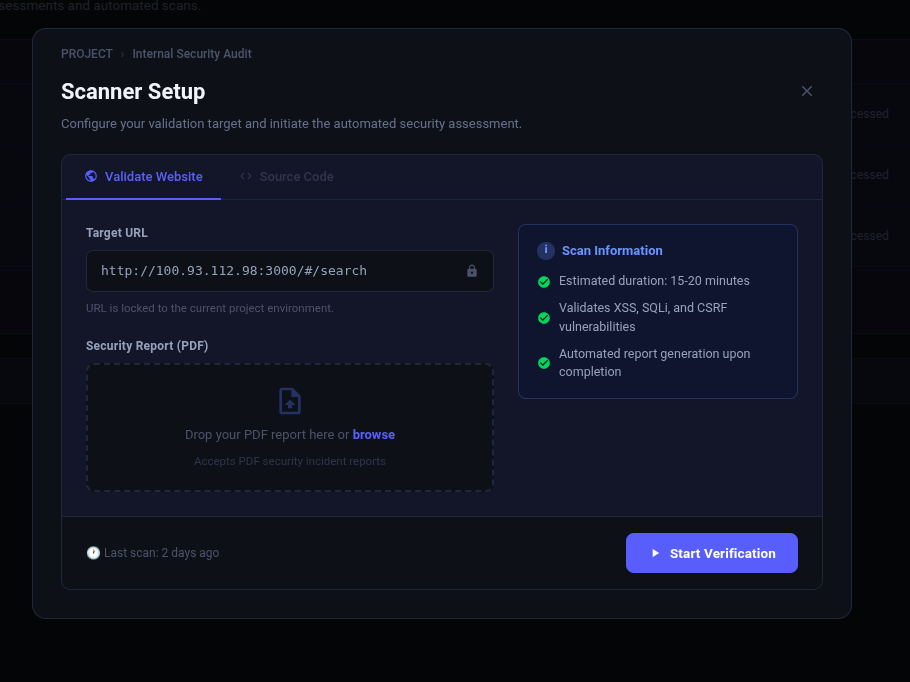
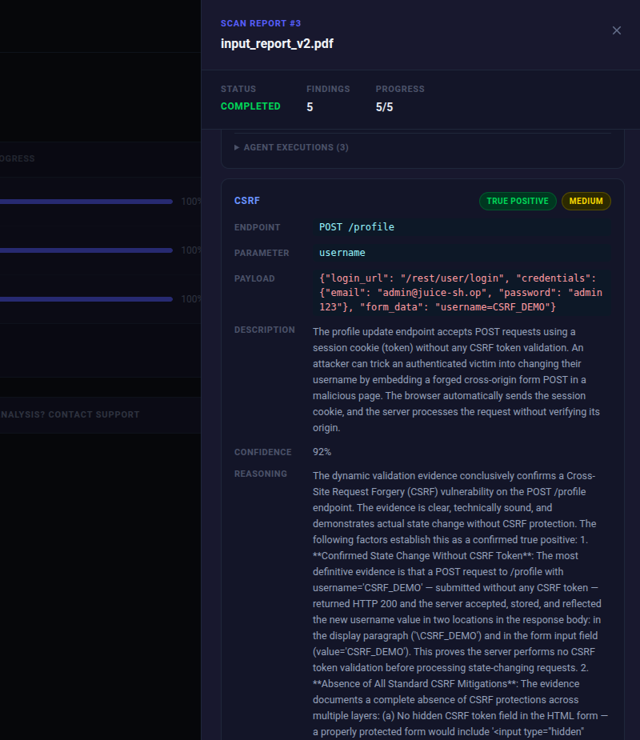

# Automated Vulnerability Triage — Documento Técnico

**Repositorio:** [github.com/shemas2015/meli_challenge_sebastian_daza](https://github.com/shemas2015/meli_challenge_sebastian_daza)

## 1. Propósito de la Aplicación

Sistema de triage automatizado de vulnerabilidades de seguridad basado en un pipeline multiagente con GenAI. Recibe reportes PDF generados por scanners de seguridad, extrae los hallazgos, ejecuta validación dinámica contra la aplicación objetivo y produce un veredicto final clasificado como **TRUE_POSITIVE**, **FALSE_POSITIVE** o **INCONCLUSIVE** — con severidad y score de confianza.

---

## 2. Arquitectura General



### Stack tecnológico

| Capa | Tecnología |
|------|-----------|
| Backend | Django 5.x + Django REST Framework |
| Agentes | CrewAI 1.x |
| LLM | Claude (Anthropic) / GPT-4 (OpenAI) / Gemini (Google) vía LiteLLM |
| Base de datos | PostgreSQL (Docker) / SQLite (local dev) |
| Frontend | React 18 + Vite |
| Infraestructura | Docker Compose (4 servicios) |
| Target de prueba | OWASP Juice Shop |
| API Docs | drf-spectacular (OpenAPI/Swagger) |

### Patrones de diseño aplicados

- **Repository Pattern** — capa de acceso a datos aislada en `repositories/`
- **Service Layer** — lógica de negocio en `services/`, separada de vistas y modelos
- **Factory Pattern** — `LLMProvider.get_llm()` desacopla el proveedor de LLM del resto del sistema
- **Abstract Base Class** — `BaseVulnerabilityAgent` define la interfaz de todos los agentes
- **Pipeline Pattern** — orquestación secuencial de agentes en `orchestrator.py`

---

## 3. Pipeline de Agentes (CrewAI)

Cada agente es una instancia de `BaseVulnerabilityAgent` que implementa `_create_agent()`, `create_task()` y `process_result()`. El orquestador los ejecuta en secuencia pasando el contexto acumulado.

```
report_data
    │
    ▼
┌─────────────────────────────────────────┐
│  ParserAgent                            │
│  Estructura el reporte en campos        │
│  tipados: type, endpoint, method,       │
│  parameter, payload                     │
└──────────────────┬──────────────────────┘
                   │  parsed_data
                   ▼
┌─────────────────────────────────────────┐
│  DynamicValidatorAgent  (opcional)      │
│  Recibe parsed_data + resultado HTTP    │
│  Evalúa: ¿el payload fue explotable?    │
│  Output: exploitability, severity,      │
│  confidence                             │
└──────────────────┬──────────────────────┘
                   │  dynamic_validation
                   ▼
┌─────────────────────────────────────────┐
│  TriageAgent                            │
│  Sintetiza toda la evidencia            │
│  Output: validation_status, severity,   │
│  confidence_score, reasoning,           │
│  recommendation                         │
└─────────────────────────────────────────┘
```

**Decisiones de diseño relevantes:**

- `temperature=0.1` → output determinístico y consistente entre ejecuciones
- Los agentes esperan JSON envuelto en markdown code blocks; `_extract_raw()` lo parsea con regex
- El proveedor de LLM se inyecta por variable de entorno; el código de los agentes no cambia al hacer el switch
- `DynamicValidatorAgent` se saltea si `run_dynamic=False` o si no hay resultado dinámico disponible — el pipeline continúa igual

**Agente especial — PDFParserAgent:**
Fuera del pipeline principal. Recibe texto plano del PDF y retorna un array JSON de findings. Cada finding pasa por `validate_finding()` que determina si tiene los campos mínimos para ejecutar el análisis automático (`can_auto_test`).

---

## 4. Modelos de Datos



| Modelo | Propósito | Campos clave |
|--------|-----------|-------------|
| `ScanReport` | Registro del PDF subido | `status`, `total_findings`, `processed_findings`, `error_message` |
| `VulnerabilityReport` | Hallazgo individual | `type`, `endpoint`, `method`, `parameter`, `payload`, `target_url`, `can_auto_test`, `skip_reason` |
| `AnalysisResult` | Output del pipeline | `validation_status`, `severity`, `confidence_score`, `agent_reasoning`, `dynamic_analysis_result` (JSON), `analysis_duration` |
| `AgentExecution` | Traza de cada agente | `agent_type`, `llm_prompt`, `llm_response`, `tokens_used`, `success`, `error_message` |

**`AgentExecution` es clave para observabilidad**: guarda el prompt completo y la respuesta de cada agente, permitiendo auditar y debuggear el razonamiento del LLM sin re-ejecutar el análisis.

**Tipos de vulnerabilidad soportados:** `SQL_INJECTION`, `XSS`, `PATH_TRAVERSAL`, `CSRF`, `IDOR`

**Veredictos posibles:** `TRUE_POSITIVE` · `FALSE_POSITIVE` · `INCONCLUSIVE`

**Severidades:** `CRITICAL` · `HIGH` · `MEDIUM` · `LOW` · `INFO`

---

## 5. API Design

Base URL: `http://localhost:8000/api/vulnerabilities/`

| Método | Endpoint | Propósito | Respuesta |
|--------|----------|-----------|-----------|
| `POST` | `/upload` | Subir PDF | `202` + ScanReport ID |
| `GET` | `/uploads/` | Listar reportes | Array de ScanReports |
| `GET` | `/uploads/<id>/` | Estado + findings + analyses | ScanReport detallado |
| `GET` | `/reports/` | Listar vulnerabilidades | Array de VulnerabilityReports |
| `GET` | `/analyses/` | Listar resultados | Array de AnalysisResults |
| `GET` | `/analyses/by_status/?status=` | Filtrar por estado | Resultados filtrados |
| `GET` | `/analyses/by_validation_status/?validation_status=` | Filtrar por veredicto | Resultados filtrados |
| `GET` | `/docs/` | Swagger UI | — |

---

## 6. Levantar el Stack Completo

### Variables de entorno

Copiar el archivo de ejemplo y completar las claves necesarias:

```bash
cp .env.example .env
```

Editar `.env` en la raíz del proyecto:

```bash
# Django
DEBUG=1
SECRET_KEY=your-secret-key-here
ALLOWED_HOSTS=localhost,127.0.0.1

# Base de datos (no modificar si se usa Docker Compose)
DATABASE_URL=postgresql://postgres:postgres@db:5432/vuln_triage

# LLM — completar al menos una clave según el proveedor a usar
ANTHROPIC_API_KEY=your-anthropic-api-key
OPENAI_API_KEY=your-openai-api-key
GOOGLE_API_KEY=your-google-api-key
```

### Puertos requeridos

Los siguientes puertos deben estar **libres en la máquina host** antes de levantar los servicios:

| Puerto | Servicio | Descripción |
|--------|----------|-------------|
| `5432` | `db` | PostgreSQL |
| `8000` | `backend` | Django REST API |
| `5174` | `frontend` | React dashboard (Nginx) |
| `3000` | `juice-shop` | OWASP Juice Shop |

### Iniciar servicios

```bash
docker-compose up -d
docker-compose exec backend python manage.py migrate
```

### Verificar que todo levantó

```bash
docker-compose ps
```

### Detener servicios

```bash
docker-compose down
```

---

## 7. Testing

**Framework:** `pytest` + `pytest-django`

**Estrategia:** Los agentes CrewAI y las llamadas a LLM se mockean con `unittest.mock.patch`. Los tests verifican el comportamiento del sistema sin incurrir en costos de API ni dependencias externas.

**Cobertura por capa:**

| Capa | Qué se testea |
|------|--------------|
| API Endpoints | Upload sin archivo → 400, archivo no-PDF → 400, PDF válido → 202, polling de status |
| `PDFParserAgent` | Extracción de findings, `validate_finding()` con campos completos e incompletos |
| `DynamicAnalyzer` | Ejecución de payloads, análisis de respuestas HTTP |
| `VulnerabilityAnalysisService` | Pipeline completo mockeando el orquestador |
| `ScanReportService` | Procesamiento async, manejo de PDF sin texto, findings con y sin auto-test |
| Modelos | Relaciones ORM, querysets por status/validation_status |

```bash
# Ejecutar todos los tests dentro del contenedor backend
docker compose exec backend python manage.py test

# Test file específico
docker compose exec backend python manage.py test vulnerabilities.tests

# Con reporte de cobertura
docker compose exec backend python manage.py test --verbosity=2
```

**Utilidad helper `_make_pdf_bytes()`:** genera un PDF mínimo válido para tests de upload sin depender de archivos en disco.

---

## 8. Ejemplo de Ejecución

Las pruebas del sistema se realizaron con el reporte `input_report_v2.pdf`. El siguiente comando sube el archivo y dispara el pipeline completo:

```bash
curl -X POST http://localhost:8000/api/vulnerabilities/upload \
  -F "file=@input_report_v2.pdf" \
  -F "llm_provider=anthropic"
```

La respuesta inmediata (`HTTP 202`) incluye el `id` del `ScanReport`. Con ese ID se puede consultar el progreso:

```bash
curl http://localhost:8000/api/vulnerabilities/upload/<id>/
```

---

## 9. Frontend

Interfaz web construida en **React 18 + Vite**, servida en el puerto `5174`. Se comunica con el backend vía REST y permite operar el sistema completo sin usar la línea de comandos.

### Pantalla principal — listado de scans

Muestra todos los reportes PDF procesados con su estado (`PENDING`, `PROCESSING`, `COMPLETED`, `FAILED`), la cantidad de findings encontrados y los resultados de cada análisis de vulnerabilidad.



### Cargar nuevo reporte

Formulario para subir un PDF de scanner. Una vez enviado, el sistema procesa el reporte en background y actualiza el estado en tiempo real.



### Detalle de un scan

Vista expandida de un scan individual. Muestra cada vulnerabilidad encontrada con su veredicto (`TRUE_POSITIVE`, `FALSE_POSITIVE`, `INCONCLUSIVE`), severidad, score de confianza y el razonamiento completo del agente de triage.



---

*Stack: Django 5 · CrewAI 1.x · LiteLLM · PostgreSQL · React 18 · Docker*
